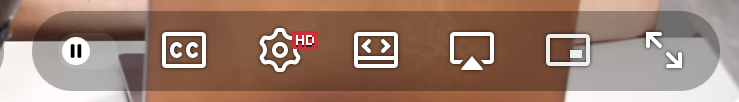

# pake-youtube-pip

Adds a **Picture-in-Picture button** and an **`Alt+P` keyboard shortcut** to a
[Pake](https://github.com/tw93/Pake)-wrapped YouTube desktop app on macOS.


<!-- TODO: replace docs/screenshot.png with a real screenshot of the PiP button
     in the YouTube player control bar. -->

## Why

Pake wraps web apps in a native WebView. When YouTube runs inside that WebView,
Safari's usual native Picture-in-Picture triggers (the right-click PiP menu and
the built-in PiP button) aren't exposed the way they are in a normal Safari tab,
so there's no obvious way to pop the video out. This injects a PiP control that
calls the WebKit/standard PiP APIs directly, restoring that capability.

## What it does

- Adds a PiP button to YouTube's player control bar, immediately left of the
  fullscreen button, using YouTube's own icon styling so it looks native.
- Binds **`Alt+P`** to toggle Picture-in-Picture from anywhere in the app.
- Toggles correctly in both directions, using `webkitSetPresentationMode`
  (WebKit) with a fallback to the standard `requestPictureInPicture()` API.

## How it works (self-healing injection)

YouTube is a single-page app that constantly rebuilds its DOM (navigating
between videos, entering/leaving fullscreen, miniplayer, etc.), so a button
injected once tends to disappear. [`pip-inject.js`](pip-inject.js) handles this:

- A `setInterval` runs once a second and re-adds the button if it's missing.
  The check is a cheap `getElementById` first, so once the button exists the
  tick is near-free; if YouTube rebuilds the control bar and drops it, the
  button reappears within ~1 second.
- It only injects on `/watch` pages, and picks the **visible**
  `.ytp-right-controls` bar (YouTube keeps several in the DOM for the main
  player, miniplayer, and inline previews).
- The icon is built with DOM APIs (`createElementNS`), not `innerHTML`, to
  satisfy YouTube's Trusted Types Content-Security-Policy.

## Install (prebuilt app)

Download `YouTube.dmg` from the [Releases](../../releases) page, open it, and
drag the app to Applications.

> **Security note:** the released `.dmg` is an **unsigned, ad-hoc build** — it is
> not notarized with an Apple Developer ID. macOS Gatekeeper will warn that the
> app "cannot be opened because the developer cannot be verified." To open it:
> right-click the app → **Open** → **Open**, or allow it under
> **System Settings → Privacy & Security**. If you'd rather not trust a prebuilt
> binary, build it yourself with the steps below — the source is right here.

## Build it yourself

The app is produced with the [Pake](https://github.com/tw93/Pake) CLI, injecting
[`pip-inject.js`](pip-inject.js) into a YouTube wrapper.

1. Install the Pake CLI (requires Rust + Node; see Pake's docs for prerequisites):

   ```sh
   npm install -g pake-cli
   ```

2. Build the app, injecting the PiP script:

   ```sh
   pake https://www.youtube.com/ --inject pip-inject.js --hide-title-bar
   ```

   This produces `YouTube.dmg` in the working directory.

See the [Pake CLI documentation](https://github.com/tw93/Pake/blob/master/bin/README.md)
for all available flags (icon, window size, user agent, etc.).

## Credits

This project distributes an application built with
**[Pake](https://github.com/tw93/Pake)** by [tw93](https://github.com/tw93).

Pake is open source under **GPL-3.0**. Its README states:

> "Pake is open source under GPL-3.0, see LICENSE and Pake Output Exception;
> apps you build with Pake are entirely yours to use and distribute."

Under that **Pake Output Exception**, applications you build with Pake (such as
the `YouTube.dmg` distributed here) are not bound by GPL-3.0 and are yours to
use and distribute. See Pake's [LICENSE](https://github.com/tw93/Pake/blob/master/LICENSE).

"YouTube" is a trademark of Google LLC. This project is not affiliated with,
endorsed by, or sponsored by Google or YouTube.

## License

The original injection script ([`pip-inject.js`](pip-inject.js)) is licensed
**MIT** — see [LICENSE](LICENSE). The bundled `YouTube.dmg` is a Pake build
output, covered by the Pake Output Exception described above, not by this MIT
license.
