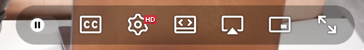

# pake-youtube-pip

Adds a **Picture-in-Picture button** (with an **`Alt+P` shortcut** and automatic
window hiding), **back/forward navigation**, **working fullscreen video**, and
**outbound links that open in your default browser** to a
[Pake](https://github.com/tw93/Pake)-wrapped YouTube desktop app on macOS.


<!-- TODO: replace docs/screenshot.png with a real screenshot of the PiP button
     in the YouTube player control bar. -->

## Why

Pake wraps web apps in a native WebView. When YouTube runs inside that WebView,
Safari's usual native Picture-in-Picture triggers (the right-click PiP menu and
the built-in PiP button) aren't exposed the way they are in a normal Safari tab,
so there's no obvious way to pop the video out. This injects a PiP control that
calls the WebKit/standard PiP APIs directly, restoring that capability.

## What it does

### Picture-in-Picture ([`pip-inject.js`](pip-inject.js))

- Adds a PiP button to YouTube's player control bar, immediately left of the
  fullscreen button, using YouTube's own icon styling so it looks native.
- Binds **`Alt+P`** to toggle Picture-in-Picture from anywhere in the app.
- Toggles correctly in both directions, using `webkitSetPresentationMode`
  (WebKit) with a fallback to the standard `requestPictureInPicture()` API.
- **Hides the app window while PiP is active**, and brings it back — shown and
  focused — as soon as you leave PiP, however you leave it. Pake keeps the
  WebView alive when the window goes away, so the video plays throughout. Without
  this the full-size window just sits on top of the PiP overlay, and returning
  from PiP puts the video back into a window you can't see. Clicking the Dock
  icon also brings it back at any time.

### Link handling ([`links-inject.js`](links-inject.js))

YouTube wraps every outbound link in a description or comment as
`youtube.com/redirect?…&q=<encoded url>`. Pake decides internal vs. external by
comparing root domains, so it sees `youtube.com`, calls the link internal, and
opens the third-party site *inside the app* — where there's no browser chrome to
get back with. The same check fails the other way for `youtu.be`: different root
domain, so a link to a YouTube **video** gets thrown out to Safari.

This unwraps the destination first and then routes on it:

- **External links open in your default browser** and the app stays where it was.
- **YouTube links stay in the app** — other videos, timecodes, channels,
  playlists — including `youtu.be` short links, which are rewritten to
  `/watch?v=…` with `t`/`list` preserved. Google sign-in and consent flows also
  stay in-app so logging in still works.
- If a navigation reaches the `/redirect` interstitial some other way (a
  `window.open`, an SPA route), that page bails out on its own: it opens the
  destination externally and goes back.
- As a last resort, any page in the app that isn't YouTube gets a small
  **"← Back to YouTube"** pill in the top-left corner.

### Back/forward navigation ([`nav-inject.js`](nav-inject.js))

Pake's WebView has no browser chrome, so once you click into a video there is
no obvious way back. This adds:

- A **back button** in YouTube's top bar, between the hamburger menu and the
  logo, styled like YouTube's own icon buttons. Where the WebView supports the
  Navigation API it dims when there's nothing to go back to; otherwise it stays
  enabled and clicking at the start of history is a harmless no-op.
- **`Cmd+←` / `Cmd+→`** for back/forward, matching Safari. Disabled while
  typing in a text field, where `Cmd+←` means "beginning of line".
  (Pake itself also binds **`Cmd+[` / `Cmd+]`** out of the box.)
- **Mouse back/forward buttons** (buttons 4/5 on multi-button mice).

### Real fullscreen (a patch to Pake, not an injection)

Fullscreen in a Pake-built YouTube app has never actually worked: you either
get the bare `<video>` filling the screen with no control bar, or — with an
injected shim — a fullscreen *window* wrapped around an unchanged, normal-sized
player.

**The cause is a single missing build flag in Pake, not anything about
YouTube.** wry only enables WebKit's HTML5 Fullscreen API when it sets the
WKWebView `fullScreenEnabled` preference, and it only does that under
`#[cfg(feature = "fullscreen")]`. That wry feature is reachable only through
`tauri/macos-private-api`, which Pake does not enable — so element fullscreen is
*compiled out of the webview*, `document.fullscreenEnabled` is false, and
`requestFullscreen()` doesn't exist. Everything else is downstream of that:

- Pake ≥ 3.14.0 ships a JS polyfill that fakes the API by CSS-pinning and
  **reparenting the raw `<video>`** to `<body>`. The video fills the screen but
  YouTube's control bar is buried, and moving the element out of the player
  breaks YouTube's own event handling — closed upstream as a known limitation
  ([Pake #1113](https://github.com/tw93/Pake/issues/1113)).
- An earlier version of this repo went the other way and emulated the API purely
  in JavaScript, with no DOM changes. That can't work either: a real
  `requestFullscreen()` also sets the browser's internal fullscreen flag, moves
  the element into the **top layer**, makes `:fullscreen` match, and applies UA
  sizing. None of that is reachable by redefining JS getters — so the window went
  fullscreen and the page didn't.

So this repo doesn't inject a fullscreen script at all any more. It **patches
Pake to turn the real API on** (see [Patched Pake](#patched-pake) below) and
makes Pake's polyfill stand down when it detects that the native API is
available. Fullscreen then behaves exactly as it does in Safari: the video fills
the display, the control bar fades in on mouse move and auto-hides, `F` toggles,
`Esc` exits — handled by WebKit, with no JavaScript in the path.

The only fullscreen-related script left is
[`titlebar-inject.js`](titlebar-inject.js): with `--hide-title-bar`, Pake pins a
20px transparent window-drag strip (`#pake-top-dom`) to the top of the viewport.
If the fullscreen element ends up containing that strip, it keeps painting over
YouTube's title/share overlay and swallows clicks there. One CSS rule hides it
while anything is fullscreen; it's a no-op otherwise.

## How it works (self-healing injection)

YouTube is a single-page app that constantly rebuilds its DOM (navigating
between videos, entering/leaving fullscreen, miniplayer, etc.), so a button
injected once tends to disappear. All four injected scripts handle this the
same way:

- A `setInterval` runs once a second and re-adds the button if it's missing.
  The check is a cheap `getElementById` first, so once the button exists the
  tick is near-free; if YouTube rebuilds the control bar (or masthead) and
  drops it, the button reappears within ~1 second.
- The PiP script only injects on `/watch` pages, and picks the **visible**
  `.ytp-right-controls` bar (YouTube keeps several in the DOM for the main
  player, miniplayer, and inline previews).
- The icons are built with DOM APIs (`createElementNS`), not `innerHTML`, to
  satisfy YouTube's Trusted Types Content-Security-Policy.

## Install (prebuilt app)

Download `YouTube.dmg` from the [Releases](../../releases) page, open it, and
drag the app to Applications.

> **Security note:** the released `.dmg` is an **unsigned, ad-hoc build** — it is
> not notarized with an Apple Developer ID. macOS Gatekeeper will warn that the
> app "cannot be opened because the developer cannot be verified." To open it:
> right-click the app → **Open** → **Open**, or allow it under
> **System Settings → Privacy & Security**. If you'd rather not trust a prebuilt
> binary, build it yourself with the steps below — the source is right here.

## Build it yourself

The app is produced with the [Pake](https://github.com/tw93/Pake) CLI. `pake-cli`
is pinned as a local dev dependency here rather than installed globally, because
the build applies a small patch to it (see [Patched Pake](#patched-pake)).

Prerequisites: Node ≥ 18, Rust, and Xcode Command Line Tools (see
[Pake's prerequisites](https://tauri.app/start/prerequisites/)).

```sh
npm ci          # installs pake-cli 3.15.3 and applies patches/ to it
npm run build:app
```

The app icon comes from [`assets/icon.svg`](assets/icon.svg) — Pake rasterizes
it, applies the macOS squircle mask, and generates the `.icns`. Swap that file
to change the icon; no other change is needed.

That produces `Youtube.dmg`. The first build compiles the whole
Tauri/Rust dependency tree and takes roughly 10 minutes; later builds are much
faster. The Rust build cache lives in `.cargo-target/` (gitignored), so
reinstalling `node_modules` doesn't throw it away.

Two more commands:

```sh
npm run verify:features   # proves native fullscreen was compiled in
npm run build:app:debug   # builds YouTube.app with WebKit devtools enabled
```

`verify:features` reads cargo's build fingerprints and checks that `wry` was
compiled with `fullscreen` and `tauri` with `macos-private-api`. If that check
fails, the app silently falls back to Pake's polyfill and fullscreen will be
broken again — so it's worth running after any dependency change.

See the [Pake CLI documentation](https://github.com/tw93/Pake/blob/master/docs/cli-usage.md)
for all available flags (icon, window size, user agent, etc.).

## Patched Pake

`pake-cli` compiles its own `src-tauri` at build time, so the only way to change
how the app's WebView is configured is to patch the installed package.
[`scripts/patch-pake.mjs`](scripts/patch-pake.mjs) does that automatically on
`npm ci` and before every build. It's idempotent, and it hard-fails if `pake-cli`
is any version other than the pinned `3.15.3`, so a dependency bump can't
silently ship an app without the fix.

Four patches, all in [`patches/`](patches):

| Patch | What it does |
|---|---|
| `01-cargo-macos-private-api` | Adds `macos-private-api` to the `tauri` dependency features. This is what makes wry set WKWebView's `fullScreenEnabled` preference. |
| `02-tauri-conf-macos-private-api` | Sets `app.macOSPrivateApi: true`. Not optional — `tauri-build` hard-errors if the cargo feature and this config key disagree. |
| `03-fullscreen-native-bailout` | Makes Pake's `src/inject/fullscreen.js` no-op when the native API is present, so it stops overwriting `Element.prototype.requestFullscreen`. Non-Apple platforms are unaffected. |
| `04-capabilities-window-visibility` | Adds `core:window:allow-hide` / `-show` / `-set-focus` / `-unminimize` / `-is-visible` and `core:app:allow-app-show` to `capabilities/default.json`. Pake grants `minimize` and `close` but nothing that can bring a window *back*, so without this the PiP script can't restore the window. |

Patches 1 and 2 total three added lines. Patch 3 is the one that matters for
correctness: enabling the API isn't enough on its own, because Pake's polyfill
would otherwise replace the now-working native implementation with its own.
Patch 4 is unrelated to fullscreen — it only widens the Tauri permission list.

`macos-private-api` sets a WebKit preference through an undocumented key. That
rules out Mac App Store distribution, which is irrelevant for an unsigned `.dmg`;
it needs no entitlement and works fine under the hardened runtime. (WebKit has
had a public `setElementFullscreenEnabled:` since macOS 12.3, so a
private-API-free variant is possible if it's ever needed.)

**This is meant to be temporary.** Upstream tracks the symptom as
[Pake #1113](https://github.com/tw93/Pake/issues/1113), closed as a known
limitation of the polyfill. If Pake ever enables the feature itself, bump the
dependency, delete `patches/` and `scripts/patch-pake.mjs`, and drop the
`postinstall` / `prebuild:app` hooks from `package.json` — nothing else here
depends on them.

## Credits

This project distributes an application built with
**[Pake](https://github.com/tw93/Pake)** by [tw93](https://github.com/tw93).

Pake is open source under **GPL-3.0**. Its README states:

> "Pake is open source under GPL-3.0, see LICENSE and Pake Output Exception;
> apps you build with Pake are entirely yours to use and distribute."

Under that **Pake Output Exception**, applications you build with Pake (such as
the `YouTube.dmg` distributed here) are not bound by GPL-3.0 and are yours to
use and distribute. See Pake's [LICENSE](https://github.com/tw93/Pake/blob/master/LICENSE).

"YouTube" is a trademark of Google LLC. This project is not affiliated with,
endorsed by, or sponsored by Google or YouTube.

## License

The original injection scripts ([`pip-inject.js`](pip-inject.js),
[`nav-inject.js`](nav-inject.js), [`links-inject.js`](links-inject.js),
[`titlebar-inject.js`](titlebar-inject.js)),
the build scripts in [`scripts/`](scripts), and the patches in
[`patches/`](patches) are licensed **MIT** — see [LICENSE](LICENSE). The
released `.dmg` is a Pake build output, covered by the Pake Output Exception
described above, not by this MIT license.
